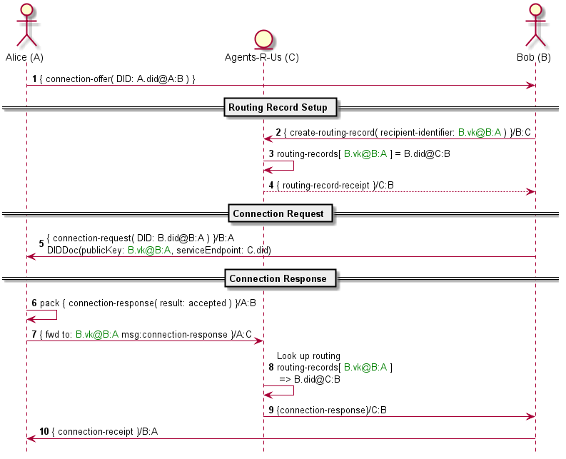
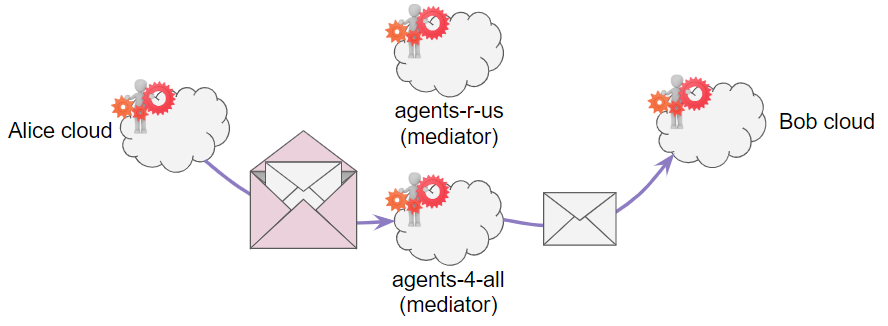
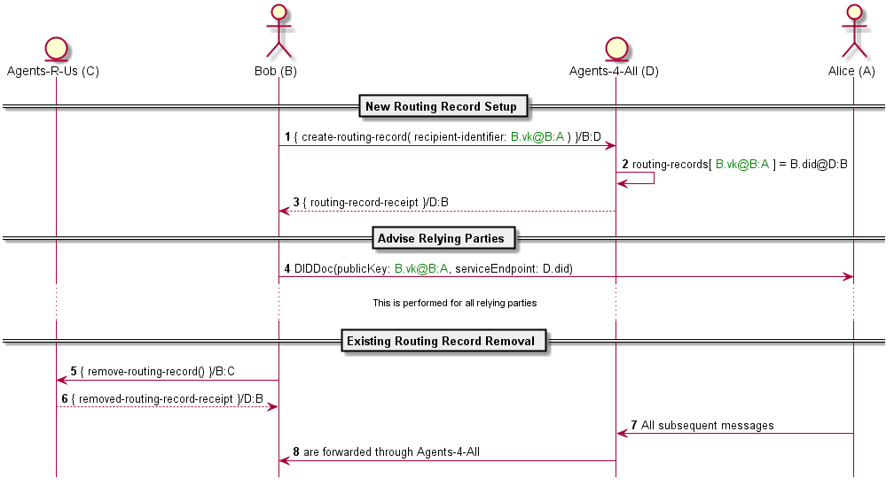

- Name: agent-message-routing
- Author: Tobias Looker
- Start Date: 2018-11-22
- PR: (leave this empty)
- Jira Issue: (leave this empty)

# Summary
[summary]: #summary

Defines the message types required to administer routing records, which are required to enable delivery of A2A messages in complex agent domains. Describes how A2A message routing is accomplished in the presence of these routing records.

# Motivation
[motivation]: #motivation

Routing records will underpin the ability to successfully deliver an agent message through a complicated domain, it is therefore important that the administration of these records is well understood and standardised.

[Cross domain messaging](https://github.com/hyperledger/indy-hipe/tree/master/text/0022-cross-domain-messaging) introduced the forward message type and this HIPE intends to define the message types required for an agent to maintain the routing records to which the forward message type depends.

# Tutorial

## New Connection Example

Bob and Alice want to connect so they can exchange messages.

Alices Agent sends Bob Agent a connection invitation out of band of the following form.

```json
{
  "@type": "did:sov:BzCbsNYhMrjHiqZDTUASHg;spec/connections/1.0/invitation",
  "DID" : "<A.did@A:B>",
  "label" : "Alice"
}
```

Prior to Bob sending Alice a connection request, in response to this invite, some setup is required to host the connection and establish its delivery path.

Lets assume the below about the delivery path of messages to Bob's Agent from Alices Agent once they are connected.


Note - lets also assume that Alice's agent (for Bob) is directly contactable and has no routing required.

Bob first generates the following pairwise DID and Verkey that he will disclosed in a connection request to Alice.

DID = `B.did@B:A`

Verkey = `B.vk@B:A`

**Routing Record Setup** (Steps 2-4 on UML diagram below)

In order for a message to successfully reach Bob from Alice via the elected mediator (agents-r-us), Bob must now connect with agents-r-us and create a routing record to establish the delivery path back to his agent. 

Note - for this example it is assumed that agents-r-us and Bobs agent have connected previously and have the following pairwise DID's denoting their relationship (DIDDocs for these DID's would also have been exchanged via microledgers).

`B.did@B:C` Pairwise DID disclosed by Bob to Agents-r-us

`C.did@C:B` Pairwise DID disclosed by Agents-r-us to Bob

In the presence of this connection, Bob's agent prepares the following message to agents-r-us.

```json
{
 "@type": "did:sov:BzCbsNYhMrjHiqZDTUASHg;spec/routing/0.1/create",
 "recipient-identifier" : "<B.vk@B:A>"
}
```

Bobs agent then packs this message for agents-r-us

`pack(AgentMessage,valueOf(<C.did@C:B>), privKey(<B.sk@B:C>))`

Note - with this wire level message agents-r-us MUST be able to recover the sender. As this is the basis for the routing record.

On processing of this message agents-r-us creates the following routing record which is stored locally.

```json
{
 "recipient-identifier" : "<B.vk@B:A>",
 "DID" : "<B.did@B:C>"
}
```

Note - the DID shown above is resolved by recovering the sender from the wire message.

**Connection Request** (Step 5 on UML diagram below)

On confirmation from agents-r-us to Bobs agent that the routing record now exists, Bob sends the following connection request to Alice.

```json
{
  "@type": "did:sov:BzCbsNYhMrjHiqZDTUASHg;spec/connections/1.0/request",
  "DID": "<B.did@B:A>",
  "label": "Bob"
}
```

The DIDDoc assumed to be transmitted along side this connection request via microledger to Alice takes the following form.

```json
{
  "@context": "https://w3id.org/did/v1",
  "id": "<B.did@B:A>",
  "publicKey": [
    {"id": "1", "type": "RsaVerificationKey2018",  "owner": "<B.did@B:A>","publicKeyBase58": "<B.vk@B:A>"}
  ],
  "authentication": [
    {"type": "RsaSignatureAuthentication2018", "publicKey": "<B.pk@B:A>"}
  ],
  "service": [
    {"type": "Agency", "serviceEndpoint": "<C.did>" }
  ]
}
```

**Connection Response** (Steps 6-10 on UML diagram below)

Now Alice and Bob have exchanged pairwise DID's, Alice prepares the following message for Bob to complete the connection process, the below also shows how a message from Alice propagates to Bob via agents-r-us.

Alice's agent prepares the following message 

```json
{
  "@type": "did:sov:BzCbsNYhMrjHiqZDTUASHg;spec/connections/1.0/response",
  "result": "accepted || rejected"
}
```

And packs accordingly

`msg = pack(AgentMessage,valueOf(<B.did@B:A>), privKey(<A.sk@A:B>))`

Alices agent now takes the wire level message packed above and prepares the following message for agents-r-us, packs and sends accordingly

```json
{
  "@type" : "did:sov:BzCbsNYhMrjHiqZDTUASHg;spec/routing/1.0/forward",
  "to"   : "<B.vk@B:A>",
  "msg"  : "<msg>"
}
```

Agents-r-us receiving the above message from Alice after unpacking, looks up its routing records based on the `to` field and finds the following routing record, as first shown above.

```json
{
 "@type": "did:sov:BzCbsNYhMrjHiqZDTUASHg;spec/routing/0.1/route",
 "recipient-identifier" : "<B.vk@B:A>",
 "DID" : "<B.did@B:C>"
}
```

With this information Agents-r-us looks up DID `B.did@B:C` in its connection list for contact information and transmits the message to Bobs agent therefore completing the message delivery.

### Sequence Diagram



## Change Agent Mediator Example

`Note - in order for this example to make the most sense it is advised that the previous example is read prior.`

Lets assume the following state Bob and Alice are connected and the delivery path for messages from Alice to Bob take the following path.


Restated here for clarity is the pairwise information Bob has disclosed to Alice when connecting.

DID = `B.did@B:A`

Verkey = `B.vk@B:A`

However Bob has now decided that he no longer wants to use agents-r-us as the mediator for messages being delivered from Alice to him.

Instead he wants to use the new provider agents-4-all, the below diagram depicts what Bob ultimately wants to achieve.



Prior to Bob updating the DIDDoc he has previously shared with Alice about how to deliver messages to him, there is some setup and transfer required.

In order for a message to successfully reach Bob from Alice via the newly elected mediator (agents-4-all), Bob must now connect with agents-4-all and create a routing record to establish the delivery path back to his agent. 

Note - for this example it is assumed that agents-4-all and Bobs agent have now connected and the following pairwise DID's denoting their relationship have been exchanged (DIDDocs for these DID's would also have been exchanged via microledgers).

`B.did@B:D` Pairwise DID disclosed by Bob to Agents-4-all

`D.did@D:B` Pairwise DID disclosed by Agents-4-all to Bob

With this connection Bob prepares the following message for agents-4-all.

```json
{
 "@type": "did:sov:BzCbsNYhMrjHiqZDTUASHg;spec/routing/0.1/create",
 "recipient-identifier" : "<B.vk@B:A>"
}
```

Bobs agent then packs this message for agents-4-all

`pack(AgentMessage,valueOf(<D.did@D:B>), privKey(<B.sk@B:D>))`

Note - with this wire level message agents-4-all MUST be able to recover the sender. As this is the basis for the routing record.

On processing of this message agents-4-alls creates the following routing record which is stored locally.

```json
{
 "recipient-identifier" : "<B.vk@B:A>",
 "DID" : "<B.did@B:D>"
}
```

//TODO we need a confirmation message?????

On confirmation from agents-4-all this routing record has been commited, Bob can now proceed with updating his DIDDoc (note likely to occur via microledgers) he has shared with Alice to use agents-4-all as the mediator. The final form of his new DIDDoc will take the following.

```json
{
  "@context": "https://w3id.org/did/v1",
  "id": "<B.did@B:A>",
  "publicKey": [
    {"id": "1", "type": "RsaVerificationKey2018",  "owner": "<B.did@B:A>","publicKeyBase58": "<B.vk@B:A>"}
  ],
  "authentication": [
    {"type": "RsaSignatureAuthentication2018", "publicKey": "<B.pk@B:A>"}
  ],
  "service": [
    {"type": "Agency", "serviceEndpoint": "<D.did>" }
  ]
}
```



## Routing record definitions
The following A2A message type definitions are required for the maintenance of routing records

Create Routing Record Message

```json
{
 "@type": "did:sov:BzCbsNYhMrjHiqZDTUASHg;spec/routing/0.1/create",
 "recipient-identifier" : "<recipient-identifier>"
}
```

Delete Routing Record Message

```json
{
 "@type": "did:sov:BzCbsNYhMrjHiqZDTUASHg;spec/routing/0.1/delete",
 "recipient-identifier" : "<recipient-identifier>"
}
```

Get Routing Records Message

```json
{
 "@type": "did:sov:BzCbsNYhMrjHiqZDTUASHg;spec/routing/0.1/get"
}
```

Routing Records Message

```json
{
 "@type": "did:sov:BzCbsNYhMrjHiqZDTUASHg;spec/routing/0.1/routes",
 "recipient-identifiers" : ["<recipient-identifier>"]
}
```

Forward to multiple recipients

```json
{
  "@type" : "did:sov:BzCbsNYhMrjHiqZDTUASHg;spec/routing/1.0/forward-multiple",
  "to"   : [ "<B.1.vk:A:B>", "<B.2.vk:A:B>", "<B.3.vk:A:B>" ],
  "msg"  : "<pack(AgentMessage,valueOf(<B.1.vk>), privKey(<A.1.sk@A:B>))>"
}
```

Note - the above message type is a variation on the `forward message type` that was proposed [here](https://github.com/hyperledger/indy-hipe/tree/master/text/0022-cross-domain-messaging)


## DID Doc conventions

//TODO not sure if this should be here?

The current [DID spec](https://w3c-ccg.github.io/did-spec/) specifies the format of [service endpoints](https://w3c-ccg.github.io/did-spec/#service-endpoints) which enables the expression of the available services associated to the DID.

Below are a list of suggested standard conventions for service endpoints of known types.

```json
{
    "id": "did:example:123456789abcdefghi;pushnotification",
    "type": "PushNotificationService",
    "serviceEndpoint": "https://push.notification.com/12345678"
}

{
    "id": "did:example:123456789abcdefghi;inbox",
    "type": "InboxService",
    "serviceEndpoint": "https://inbox.example.com/12345678"
}

{
    "id": "did:example:123456789abcdefghi;agency",
    "type": "Agency",
    "serviceEndpoint": "https://agency.example.com/8377464"
}
```

# Reference

- [Cross Domain Messaging](https://github.com/hyperledger/indy-hipe/tree/master/text/0022-cross-domain-messaging)
- [Connection Protocol](https://github.com/hyperledger/indy-hipe/blob/2cd01124a6dc320d80821139d6fc042a842e9f24/text/connection-protocol/README.md)
- [Agent to Agent Communication Video](https://drive.google.com/file/d/1PHAy8dMefZG9JNg87Zi33SfKkZvUvXvx/view)
- [Agent to Agent Communication Presentation](https://docs.google.com/presentation/d/1H7KKccqYB-2l8iknnSlGt7T_sBPLb9rfTkL-waSCux0/edit#slide=id.p)

# Drawbacks

- Route spoofing is only prevented by the agent first creating routing records prior to disclosing connection information to another party.
- Suitability of A2A messaging protocol for administering routing records.
- Imposes the constrain that certain A2A messages must be authcrypt to recover the sender in order for them to be valid. 

# Rationale and alternatives

- A separate protocol for administering routing records.

# Unresolved questions

- Assumptions about the role microledgers would play have been made.
